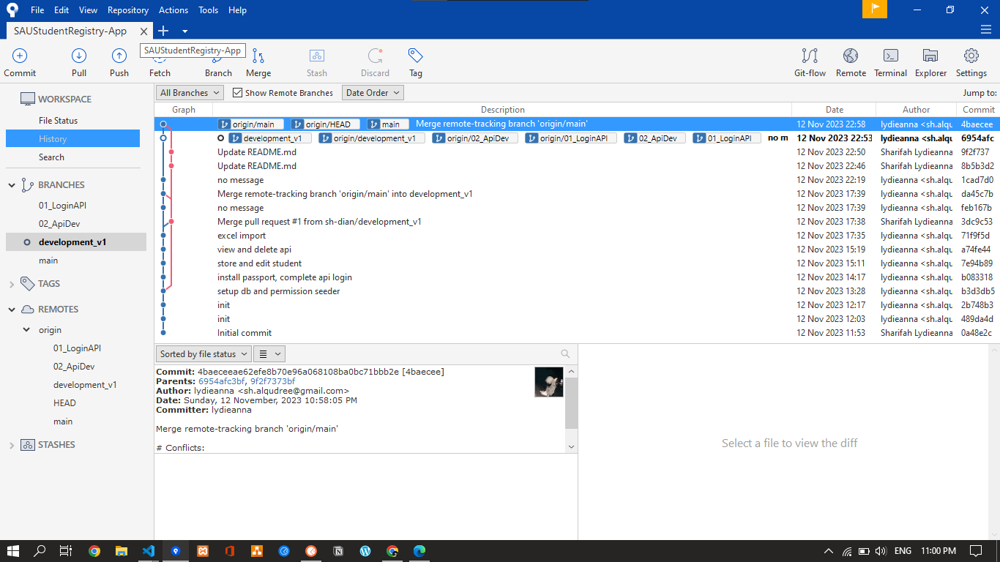

## About System

A technical assessment for VIMIGO interview. This system contain only resourceful APIs for the student registry app of South of Australia University

## Related Link
Below is related link for this project:

- **[OneDrive](https://umpedumy-my.sharepoint.com/:f:/g/personal/cb20050_student_umpsa_edu_my/EgpjJxher_dChceam_avAZwB0uyuUWyjY_CJPw3WOCI-IA?e=ohUOZe)**
- **[Postman](https://galactic-spaceship-133685.postman.co/workspace/SAUStudentRegistryApp~cbb375f3-a4f3-4c8c-964e-8b654432e991/collection/22922760-ae677cd4-1e53-4a81-8579-0537ba4ef1f6?action=share&creator=22922760&active-environment=22922760-72219a11-f38e-41bb-98de-0198ecabde68)**

